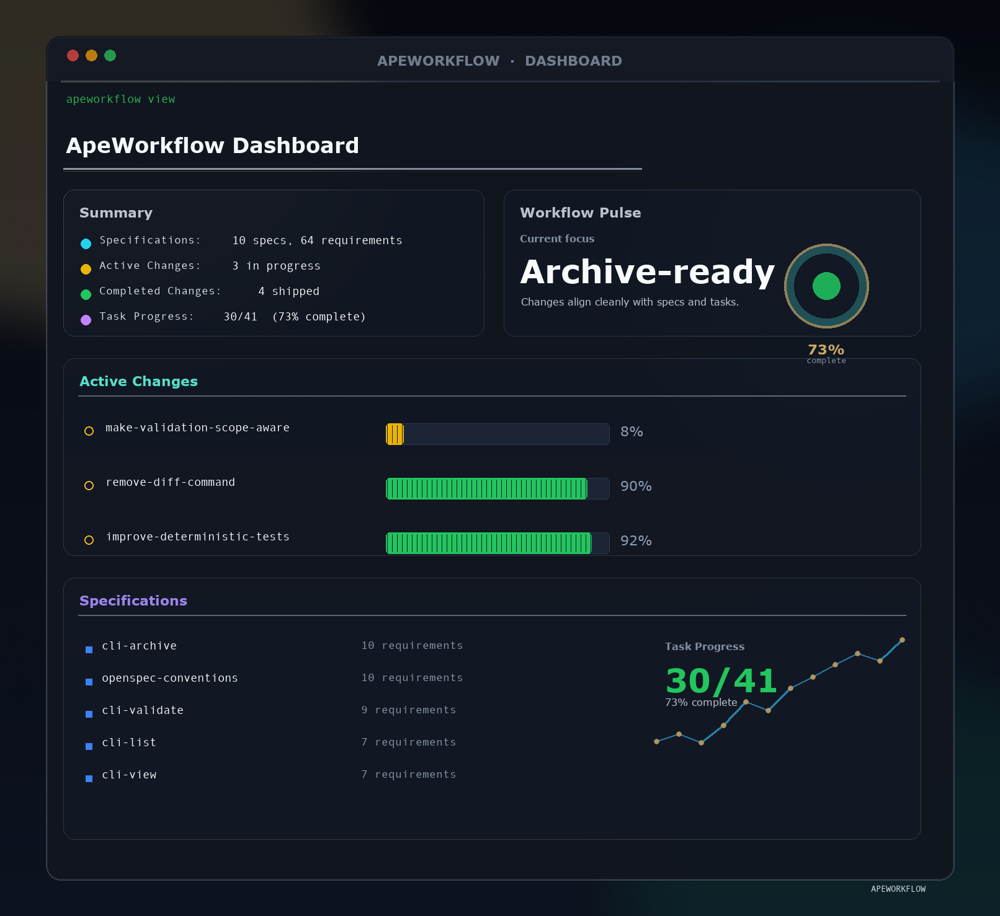

<p align="center">
  <a href="https://github.com/0xzace/ApeWorkflow">
    <picture>
      <source srcset="assets/apeworkflow_bg.png">
      
    </picture>
  </a>
</p>

<p align="center">
  <a href="https://github.com/0xzace/ApeWorkflow/actions/workflows/ci.yml"></a>
  <a href="https://www.npmjs.com/package/@0xzace/apeworkflow"></a>
  <a href="./LICENSE"></a>
  <a href="https://discord.gg/YctCnvvshC"></a>
</p>

<details>
<summary><strong>The most loved spec framework.</strong></summary>

[](https://github.com/0xzace/ApeWorkflow/stargazers)
[](https://www.npmjs.com/package/@0xzace/apeworkflow)
[](https://github.com/0xzace/ApeWorkflow/graphs/contributors)

</details>
<p></p>
Our philosophy:

```text
→ fluid not rigid
→ iterative not waterfall
→ easy not complex
→ built for brownfield not just greenfield
→ scalable from personal projects to enterprises
```

> [!TIP]
> **New workflow now available!** We've rebuilt ApeWorkflow with a new artifact-guided workflow.
>
> Run `/ape:propose "your idea"` to get started. → [Learn more here](docs/ape.md)

<p align="center">
  Follow <a href="https://x.com/0xTab">@0xTab on X</a> for updates · Join the <a href="https://discord.gg/YctCnvvshC">ApeWorkflow Discord</a> for help and questions.
</p>

<!-- TODO: Add GIF demo of /ape:propose → /ape:archive workflow -->

## See it in action

```text
You: /ape:propose add-dark-mode
AI:  Created apeworkflow/changes/add-dark-mode/
     ✓ proposal.md — why we're doing this, what's changing
     ✓ specs/       — requirements and scenarios
     ✓ design.md    — technical approach
     ✓ tasks.md     — implementation checklist
     Ready for implementation!

You: /ape:apply
AI:  Implementing tasks...
     ✓ 1.1 Add theme context provider
     ✓ 1.2 Create toggle component
     ✓ 2.1 Add CSS variables
     ✓ 2.2 Wire up localStorage
     All tasks complete!

You: /ape:archive
AI:  Archived to apeworkflow/changes/archive/2025-01-23-add-dark-mode/
     Specs updated. Ready for the next feature.
```

<details>
<summary><strong>ApeWorkflow Dashboard</strong></summary>

<p align="center">
  
</p>

</details>

## Quick Start

**Requires Node.js 20.19.0 or higher.**

Install ApeWorkflow globally:

```bash
npm install -g @0xzace/apeworkflow@latest
```

Then navigate to your project directory and initialize:

```bash
cd your-project
apeworkflow init
```

Now tell your AI: `/ape:propose <what-you-want-to-build>`

If you want the expanded workflow (`/ape:new`, `/ape:continue`, `/ape:ff`, `/ape:verify`, `/ape:bulk-archive`, `/ape:onboard`), select it with `apeworkflow config profile` and apply with `apeworkflow update`.

> [!NOTE]
> Not sure if your tool is supported? [View the full list](docs/supported-tools.md) – we support 25+ tools and growing.
>
> Also works with pnpm, yarn, bun, and nix. [See installation options](docs/installation.md).

## Docs

→ **[Getting Started](docs/getting-started.md)**: first steps<br>
→ **[Workflows](docs/workflows.md)**: combos and patterns<br>
→ **[Commands](docs/commands.md)**: slash commands & skills<br>
→ **[CLI](docs/cli.md)**: terminal reference<br>
→ **[Supported Tools](docs/supported-tools.md)**: tool integrations & install paths<br>
→ **[Concepts](docs/concepts.md)**: how it all fits<br>
→ **[Multi-Language](docs/multi-language.md)**: multi-language support<br>
→ **[Customization](docs/customization.md)**: make it yours

## Community schemas

Third-party schema bundles distributed via standalone repositories — these provide opinionated workflows that integrate ApeWorkflow with other tools, similar to how [github/spec-kit's community extension catalog](https://github.com/github/spec-kit/tree/main/extensions) handles tool integrations.

→ **[Browse the catalog](docs/customization.md#community-schemas)** in the customization docs.

## Why ApeWorkflow?

AI coding assistants are powerful but unpredictable when requirements live only in chat history. ApeWorkflow adds a lightweight spec layer so you agree on what to build before any code is written.

- **Agree before you build** — human and AI align on specs before code gets written
- **Stay organized** — each change gets its own folder with proposal, specs, design, and tasks
- **Work fluidly** — update any artifact anytime, no rigid phase gates
- **Use your tools** — works with 20+ AI assistants via slash commands

### How we compare

**vs. [Spec Kit](https://github.com/github/spec-kit)** (GitHub) — Thorough but heavyweight. Rigid phase gates, lots of Markdown, Python setup. ApeWorkflow is lighter and lets you iterate freely.

**vs. [Kiro](https://kiro.dev)** (AWS) — Powerful but you're locked into their IDE and limited to Claude models. ApeWorkflow works with the tools you already use.

**vs. nothing** — AI coding without specs means vague prompts and unpredictable results. ApeWorkflow brings predictability without the ceremony.

## Updating ApeWorkflow

**Upgrade the package**

```bash
npm install -g @0xzace/apeworkflow@latest
```

**Refresh agent instructions**

Run this inside each project to regenerate AI guidance and ensure the latest slash commands are active:

```bash
apeworkflow update
```

## Usage Notes

**Model selection**: ApeWorkflow works best with high-reasoning models. We recommend Codex 5.5 and Opus 4.7 for both planning and implementation.

**Context hygiene**: ApeWorkflow benefits from a clean context window. Clear your context before starting implementation and maintain good context hygiene throughout your session.

## Contributing

**Small fixes** — Bug fixes, typo corrections, and minor improvements can be submitted directly as PRs.

**Larger changes** — For new features, significant refactors, or architectural changes, please submit an ApeWorkflow change proposal first so we can align on intent and goals before implementation begins.

When writing proposals, keep the ApeWorkflow philosophy in mind: we serve a wide variety of users across different coding agents, models, and use cases. Changes should work well for everyone.

**AI-generated code is welcome** — as long as it's been tested and verified. PRs containing AI-generated code should mention the coding agent and model used (e.g., "Generated with Claude Code using claude-opus-4-5-20251101").

### Development

- Install dependencies: `pnpm install`
- Build: `pnpm run build`
- Test: `pnpm test`
- Develop CLI locally: `pnpm run dev` or `pnpm run dev:cli`
- Conventional commits (one-line): `type(scope): subject`

## Other

<details>
<summary><strong>Telemetry</strong></summary>

ApeWorkflow collects anonymous usage stats.

We collect only command names and version to understand usage patterns. No arguments, paths, content, or PII. Automatically disabled in CI.

**Opt-out:** `export APEWORKFLOW_TELEMETRY=0` or `export DO_NOT_TRACK=1`

</details>

<details>
<summary><strong>Maintainers & Advisors</strong></summary>

See [MAINTAINERS.md](MAINTAINERS.md) for the list of core maintainers and advisors who help guide the project.

</details>

## License

MIT
