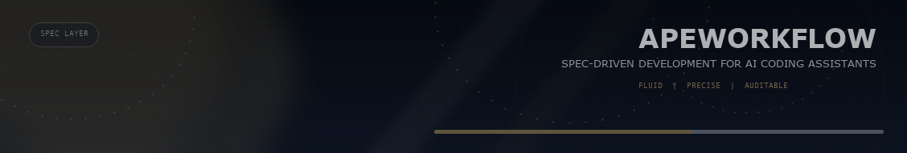
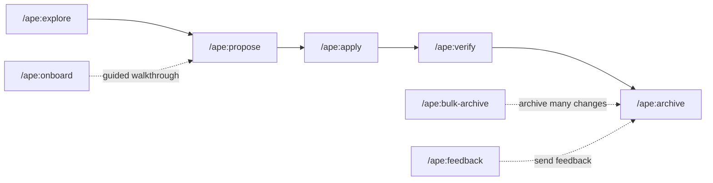

<p align="center">
  <a href="https://github.com/0xzace/ApeWorkflow">
    <picture>
      <source srcset="assets/apeworkflow_pixel_dark.svg" media="(prefers-color-scheme: dark)">
      <source srcset="assets/apeworkflow_pixel_light.svg" media="(prefers-color-scheme: light)">
      
    </picture>
  </a>
</p>

<p align="center"><strong>Spec-driven, workflow-driven development for AI coding assistants.</strong></p>

<p align="center">
  ApeWorkflow keeps intent, specs, and implementation in one fluid workflow.
  No API keys required.
</p>

<p align="center">
  <a href="https://github.com/0xzace/ApeWorkflow/actions/workflows/ci.yml"></a>
  <a href="https://www.npmjs.com/package/@0xzace/apeworkflow"></a>
  <a href="https://nodejs.org/"></a>
  <a href="./LICENSE"></a>
  <a href="https://discord.gg/YctCnvvshC"></a>
</p>

<p align="center">
  
</p>

> Agree on what to build before any code is written.
>
> Keep the source of truth in specs, and keep changes explicit.

## This Setup Will Configure

- Agent Skills for AI tools
- The current ApeWorkflow command surface
- Project-local workflow files

## Workflow-Driven Methodology

ApeWorkflow is workflow-driven, not just command-driven.

Work moves through a clear path of workflow stages, and each stage carries the right methodology for the job:

- Think through the problem with `explore`
- Turn intent into a change with `propose`
- Execute the work with `apply`
- Check the result with `verify`
- Close it out with `archive`

The methodology skills stay available as the internal playbook for those stages, so the workflow stays consistent instead of becoming a loose collection of prompts.

## Why ApeWorkflow

ApeWorkflow gives AI-assisted development a shared contract:

- **Align before implementation** - capture intent in proposals and specs first
- **Stay explicit** - keep proposed work in `apeworkflow/changes/` and current truth in `apeworkflow/specs/`
- **Adapt as you learn** - edit any artifact at any time, without forcing rigid phases
- **Work across tools** - generate native commands where supported, or use shared `AGENTS.md` guidance everywhere else

## How It Works



The visible command surface is:

```text
Core workflow: /ape:explore -> /ape:propose -> /ape:apply -> /ape:archive
Supporting commands: /ape:verify, /ape:onboard, /ape:bulk-archive, /ape:feedback
```

## What ApeWorkflow Creates

After `apeworkflow init`, your project gets a local workspace like this:

```text
apeworkflow/
├── specs/              # Source of truth
│   └── <domain>/
│       └── spec.md
├── changes/            # Proposed work
│   └── <change-name>/
│       ├── proposal.md
│       ├── design.md
│       ├── tasks.md
│       └── specs/
│           └── <domain>/
│               └── spec.md
└── config.yaml         # Optional project configuration
```

## Quick Start

### 1. Prerequisite

**Node.js 20.19.0 or higher**

### 2. Install

```bash
npm install -g @0xzace/apeworkflow@latest
```

Other package managers:

```bash
pnpm add -g @0xzace/apeworkflow@latest
yarn global add @0xzace/apeworkflow@latest
bun add -g @0xzace/apeworkflow@latest
```

Nix:

```bash
nix run github:0xzace/ApeWorkflow -- init
```

### 3. Initialize Your Project

```bash
cd your-project
apeworkflow init
```

### 4. Start the Workflow

```text
/ape:onboard
```

Or jump straight to a change:

```text
/ape:propose <what-you-want-to-build>
```

If you want to refresh generated instructions after setup, run:

```bash
apeworkflow config profile
apeworkflow update
```

## Supported AI Tools

ApeWorkflow supports 30+ AI coding assistants, including:

`Claude Code`, `Cursor`, `Codex`, `GitHub Copilot`, `Gemini CLI`, `Windsurf`, `Cline`, `Continue`, `OpenCode`, `Qwen Code`, `RooCode`, `Kilo Code`, `Kiro`, `Auggie`, `Amazon Q Developer`, and more.

See the full list in [Supported Tools](docs/supported-tools.md).

## CLI Highlights

| Command | Purpose |
| --- | --- |
| `apeworkflow init` | Initialize ApeWorkflow in a project |
| `apeworkflow update` | Refresh generated instruction files |
| `apeworkflow list` | List changes or specs |
| `apeworkflow view` | Open the interactive dashboard |
| `apeworkflow show` | Show a change or spec |
| `apeworkflow validate` | Validate changes and specs |
| `apeworkflow archive` | Archive a completed change |
| `apeworkflow status` | Show artifact completion status |
| `apeworkflow instructions` | Output enriched artifact instructions |
| `apeworkflow templates` | Show resolved template paths |
| `apeworkflow schemas` | List available workflow schemas |

Full reference: [docs/cli.md](docs/cli.md)

## Docs

- [Getting Started](docs/getting-started.md)
- [Workflows](docs/workflows.md)
- [Commands](docs/commands.md)
- [CLI](docs/cli.md)
- [Supported Tools](docs/supported-tools.md)
- [Concepts](docs/concepts.md)
- [Customization](docs/customization.md)
- [Installation](docs/installation.md)
- [APE Workflow](docs/ape.md)

## Development

```bash
pnpm install
pnpm run build
pnpm test
pnpm run dev
pnpm run dev:cli
```

## Telemetry

Anonymous usage stats are collected for command names and version only.
No arguments, paths, content, or PII are collected. Telemetry is disabled in CI.

Opt out:

```bash
export APEWORKFLOW_TELEMETRY=0
export DO_NOT_TRACK=1
```

## License

MIT
