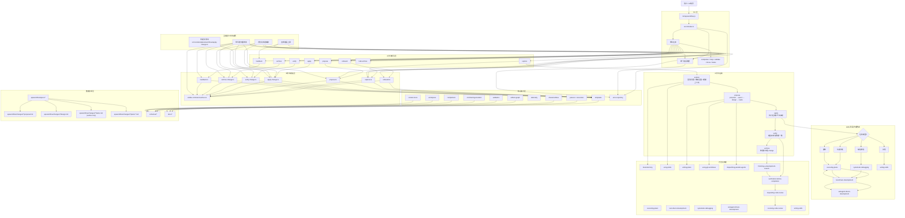

# ApeWorkflow 详细流程图

```mermaid
flowchart TB
  %% 用户入口
  U["用户 / AI 助手"]

  %% CLI 层
  subgraph CLI["CLI 层"]
    C0["bin/apeworkflow.js"]
    C1["src/cli/index.ts"]
    C2["命令注册"]
    C3["统一错误处理"]
    C4["completion / help / validate / show / status"]
  end

  %% 工作流命令层
  subgraph WF["工作流命令层"]
    W0["explore"]
    W1["propose"]
    W2["apply"]
    W3["verify"]
    W4["archive"]
    W5["onboard"]
    W6["bulk-archive"]
    W7["feedback"]
  end

  %% 工作流模板层
  subgraph TPL["工作流模板层"]
    T0["onboard.ts"]
    T1["explore.ts"]
    T2["propose.ts"]
    T3["apply-change.ts"]
    T4["verify-change.ts"]
    T5["archive-change.ts"]
    T6["feedback.ts"]
    T7["visible-command-surface.ts"]
  end

  %% 核心能力层
  subgraph CORE["核心能力层"]
    K0["artifact-graph"]
    K1["validation"]
    K2["command-generation"]
    K3["completions"]
    K4["workspace"]
    K5["context-store"]
    K6["telemetry"]
    K7["templates"]
    K8["parsers / converters"]
    K9["shared utilities"]
    K10["error-reporting"]
  end

  %% 工作流主线
  subgraph FLOW["工作流主线"]
    F0["explore\n澄清问题 / 收敛范围 / 理解上下文"]
    F1["propose\nproposal → specs → design → tasks"]
    F2["apply\n执行任务并产出实现"]
    F3["verify\n校验实现与预期一致"]
    F4["archive\n收尾并归档 change"]
  end

  %% apply 阶段内部路由
  subgraph APPLY["apply 阶段内部路由"]
    A0{"任务类型?"}
    A1["功能开发"]
    A2["缺陷修复"]
    A3["重构"]
    A4["文档"]
    A5["executing-plans"]
    A6["test-driven-development"]
    A7["subagent-driven-development"]
    A8["systematic-debugging"]
    A9["writing-skills"]
  end

  %% 方法论技能
  subgraph SKILL["方法论技能"]
    S0["brainstorming"]
    S1["using-skills"]
    S2["writing-plans"]
    S3["using-git-worktrees"]
    S4["dispatching-parallel-agents"]
    S5["executing-plans"]
    S6["test-driven-development"]
    S7["systematic-debugging"]
    S8["subagent-driven-development"]
    S9["verification-before-completion"]
    S10["requesting-code-review"]
    S11["receiving-code-review"]
    S12["finishing-a-development-branch"]
    S13["writing-skills"]
  end

  %% 当前进行中的变更
  subgraph CHANGE["当前进行中的变更"]
    M0["方法论技能映射"]
    M1["命令展示面收敛"]
    M2["自我错误上报"]
    M3["未提交改动\nsrc/core/templates/workflows/apply-change.ts"]
  end

  %% 数据与规范
  subgraph ART["数据与规范"]
    D0["apeworkflow/specs/*"]
    D1["apeworkflow/changes/*/proposal.md"]
    D2["apeworkflow/changes/*/design.md"]
    D3["apeworkflow/changes/*/tasks.md (outline only)"]
    D4["apeworkflow/changes/*/plans/*.md"]
    D5["schemas/*"]
    D6["docs/*"]
  end

  %% 入口流向
  U --> C0 --> C1 --> C2
  C2 --> W0
  C2 --> W1
  C2 --> W2
  C2 --> W3
  C2 --> W4
  C2 --> W5
  C2 --> W6
  C2 --> W7
  C2 --> C4
  C1 --> C3

  %% 命令到模板
  W5 --> T0
  W0 --> T1
  W1 --> T2
  W2 --> T3
  W3 --> T4
  W4 --> T5
  W7 --> T6

  %% 模板到核心能力
  T0 --> T7
  T1 --> T7
  T2 --> T7
  T3 --> T7
  T4 --> T7
  T5 --> T7
  T6 --> T7

  T0 --> K7
  T1 --> K7
  T2 --> K7
  T3 --> K7
  T4 --> K7
  T5 --> K7
  T6 --> K7

  C1 --> K10
  C3 --> K10

  %% 工作流主线
  W0 --> F0 --> F1 --> F2 --> F3 --> F4

  %% explore / propose 阶段内容
  F0 --> S1
  F0 --> S0
  F1 --> S2
  F1 --> S3
  F1 --> S4

  %% apply 阶段任务类型路由
  F2 --> A0
  A0 --> A1
  A0 --> A2
  A0 --> A3
  A0 --> A4

  A1 --> A5 --> A6 --> A7
  A2 --> A8 --> A6 --> A5
  A3 --> A5 --> A6 --> A7
  A4 --> A9

  %% verify / archive
  F3 --> S9 --> S10 --> S11
  F4 --> S12 --> S9

  %% 核心能力支撑
  K0 --> D5
  K1 --> D5
  K2 --> D5
  K3 --> D5
  K4 --> D5
  K5 --> D5
  K7 --> D6
  K8 --> D6
  K9 --> D6

  %% 当前变更与代码位置
  M0 --> T3
  M0 --> T1
  M0 --> T2
  M0 --> T4
  M0 --> T5

  M1 --> T7
  M1 --> T0
  M1 --> T1
  M1 --> T2
  M1 --> T3
  M1 --> T4
  M1 --> T5
  M1 --> T6

  M2 --> K10
  M2 --> C3
  M2 --> W7

  M3 --> T3

  %% 数据闭环
  D0 --> D1
  D0 --> D2
  D0 --> D3
  D0 --> D4
```
