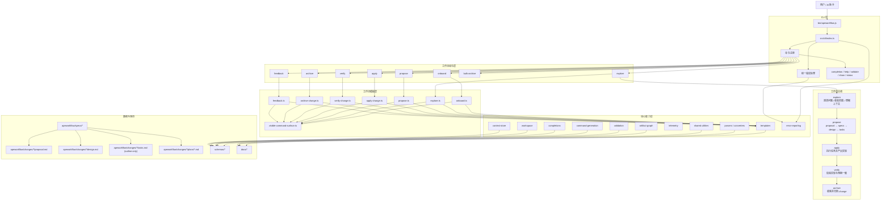
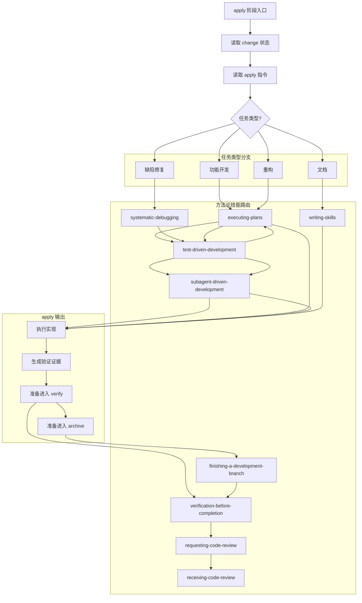
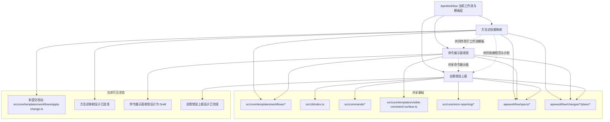

# 项目流程图

## 1. 项目总体流程图

```mermaid
flowchart TB
  U["用户 / AI 助手"]

  subgraph CLI["CLI 层"]
    C0["bin/apeworkflow.js"]
    C1["src/cli/index.ts"]
    C2["命令注册"]
    C3["统一错误处理"]
    C4["completion / help / validate / show / status"]
  end

  subgraph WF["工作流命令层"]
    W0["explore"]
    W1["propose"]
    W2["apply"]
    W3["verify"]
    W4["archive"]
    W5["onboard"]
    W6["bulk-archive"]
    W7["feedback"]
  end

  subgraph FLOW["工作流主线"]
    F0["explore\n澄清问题 / 收敛范围 / 理解上下文"]
    F1["propose\nproposal → specs → design → tasks"]
    F2["apply\n执行任务并产出实现"]
    F3["verify\n校验实现与预期一致"]
    F4["archive\n收尾并归档 change"]
  end

  subgraph TPL["工作流模板层"]
    T0["onboard.ts"]
    T1["explore.ts"]
    T2["propose.ts"]
    T3["apply-change.ts"]
    T4["verify-change.ts"]
    T5["archive-change.ts"]
    T6["feedback.ts"]
    T7["visible-command-surface.ts"]
  end

  subgraph CORE["核心能力层"]
    K0["artifact-graph"]
    K1["validation"]
    K2["command-generation"]
    K3["completions"]
    K4["workspace"]
    K5["context-store"]
    K6["telemetry"]
    K7["templates"]
    K8["parsers / converters"]
    K9["shared utilities"]
    K10["error-reporting"]
  end

  subgraph ART["数据与规范"]
    D0["apeworkflow/specs/*"]
    D1["apeworkflow/changes/*/proposal.md"]
    D2["apeworkflow/changes/*/design.md"]
    D3["apeworkflow/changes/*/tasks.md (outline only)"]
    D4["apeworkflow/changes/*/plans/*.md"]
    D5["schemas/*"]
    D6["docs/*"]
  end

  U --> C0 --> C1 --> C2
  C2 --> W0
  C2 --> W1
  C2 --> W2
  C2 --> W3
  C2 --> W4
  C2 --> W5
  C2 --> W6
  C2 --> W7
  C2 --> C4
  C1 --> C3

  W5 --> T0
  W0 --> T1
  W1 --> T2
  W2 --> T3
  W3 --> T4
  W4 --> T5
  W7 --> T6

  W0 --> F0 --> F1 --> F2 --> F3 --> F4

  T0 --> T7
  T1 --> T7
  T2 --> T7
  T3 --> T7
  T4 --> T7
  T5 --> T7
  T6 --> T7

  T0 --> K7
  T1 --> K7
  T2 --> K7
  T3 --> K7
  T4 --> K7
  T5 --> K7
  T6 --> K7

  C1 --> K10
  C3 --> K10

  K0 --> D5
  K1 --> D5
  K2 --> D5
  K3 --> D5
  K4 --> D5
  K5 --> D5
  K7 --> D6
  K8 --> D6
  K9 --> D6

  D0 --> D1
  D0 --> D2
  D0 --> D3
  D0 --> D4
```

## 2. apply 阶段详细子流程图

```mermaid
flowchart TB
  A0["apply 阶段入口"]
  A1["读取 change 状态"]
  A2["读取 apply 指令"]
  A3{"任务类型?"}

  subgraph TYPES["任务类型分支"]
    T1["功能开发"]
    T2["缺陷修复"]
    T3["重构"]
    T4["文档"]
  end

  subgraph ROUTE["方法论技能路由"]
    R1["executing-plans"]
    R2["test-driven-development"]
    R3["subagent-driven-development"]
    R4["systematic-debugging"]
    R5["writing-skills"]
    R6["verification-before-completion"]
    R7["requesting-code-review"]
    R8["receiving-code-review"]
    R9["finishing-a-development-branch"]
  end

  subgraph OUTPUT["apply 输出"]
    O1["执行实现"]
    O2["生成验证证据"]
    O3["准备进入 verify"]
    O4["准备进入 archive"]
  end

  A0 --> A1 --> A2 --> A3
  A3 --> T1
  A3 --> T2
  A3 --> T3
  A3 --> T4

  T1 --> R1 --> R2 --> R3 --> O1
  T2 --> R4 --> R2 --> R1 --> O1
  T3 --> R1 --> R2 --> R3 --> O1
  T4 --> R5 --> O1

  O1 --> O2 --> O3 --> O4
  O3 --> R6 --> R7 --> R8
  O4 --> R9 --> R6
```

## 3. 当前三项变更的关系图

```mermaid
flowchart TB
  ROOT["ApeWorkflow 当前工作流与模板层"]

  M0["方法论技能映射"]
  M1["命令展示面收敛"]
  M2["自我错误上报"]

  subgraph SHARED["共享基础"]
    S0["src/core/templates/workflows/*"]
    S1["src/cli/index.ts"]
    S2["src/commands/*"]
    S3["src/core/templates/visible-command-surface.ts"]
    S4["src/core/error-reporting/*"]
    S5["apeworkflow/specs/*"]
    S6["apeworkflow/changes/*/plans/*"]
  end

  subgraph CURRENT["当前可见状态"]
    C0["未提交改动: src/core/templates/workflows/apply-change.ts"]
    C1["方法论映射设计已批准"]
    C2["命令展示面收敛设计为 Draft"]
    C3["自我错误上报设计已完成"]
  end

  ROOT --> M0
  ROOT --> M1
  ROOT --> M2

  M0 --> S0
  M0 --> S5
  M0 --> S6
  M0 --> C0
  M0 --> C1

  M1 --> S0
  M1 --> S3
  M1 --> S5
  M1 --> S6
  M1 --> C2

  M2 --> S1
  M2 --> S2
  M2 --> S4
  M2 --> S5
  M2 --> S6
  M2 --> C3

  M0 -. 共同作用于工作流模板 .-> M1
  M1 -. 共享命令展示面 .-> M2
  M0 -. 共同依赖规范与计划 .-> M2
```
